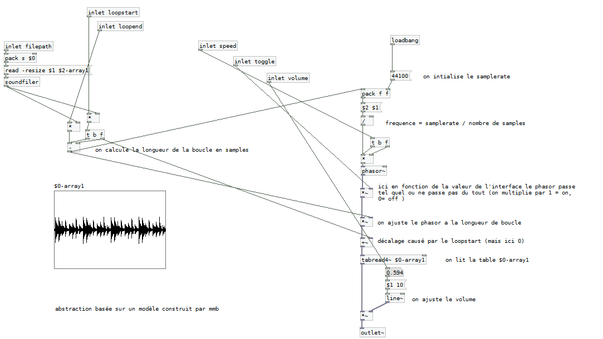

# HOW TO USE SAMPLES ?
This first example will help us to get familiar with Pure Data its interface and basically how it does work. We will learn to play audio files synched on to another using code snippets from the community, and how to control the volume of the playback. We will also discover how we can interact with a smartphone with the tools provided.

## HOW DOES IT WORK ?

This little application allows you to mix 4 audio loops together, a little interface is available (see snapshot), and for each loop you can toggle it and adjust the volume through a slider. There’s also the possibility to have several loop packs, and switch between them 

Loops were (for most of them) created from Pd patches available for download on the community forum. The app has been to designed to run on entry level smartphones (from 2012 !), if you have a powerfull smartphone, a bigger screen etc. Don’t hesitate to modify the patch to add more and more loops. Audio files need to be at a samplerate of 22050hz to be played back.

## MAIN CONCEPTS 

For further details, please refer to the comments included in the patch. The goal is not to understand everything but to have an idea how to deal with samples and keep them in synch.

The principle is simple, we need to play a pack of pre-recorded audio loops and play them in synch; that is to say that if we want to launch the next loop we will need to wait for the playing one to loop (same principle as in Abbelton Live).

We will load a pack of sounds in tables using the [soundfiler] object. To play back 4 sounds we will use 5 tables, as we will use a table to synch the playback of others, this control table will send a bang each time it loops that will be received by others. We’ll use the toggle to “arm” the playback that will start only when this bang is received.

Each loop will use a sampler abstraction (it’s simply another Pure Data patch being in the same folder as your main patch) this abstraction can be loaded by creating an object and naming it by its name. It will enable us to use the “$0-“ messaging system, which will be replaced by an unique identifier on creation. For instance a “$0-bang” will be replaced by “1088-bang” in an abstraction and by a “1055-bang” in another; it’s usefull to copy/paste chunck of codes without them interfering with one another

Something important is also to have well prepared samples. They should be the exact same duration, and recorded (or converted) at a 22050Hz, in .wav format.
