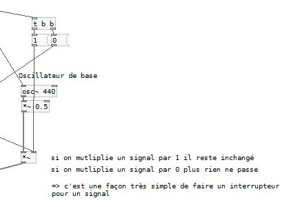

# WHAT ABOUT EFFECTS ?
Let’s have a look at the microphone input from our smartphone, we will learn how to alter the audio coming through the mic in real time.

## HOW DOES IT WORK ?
The application enables you to choose between 3 sound sources (microphone input, noise generator and a basic oscillator), sound signals will then be routed through a chain of effect, then to the speaker (or headphones).

This is a kind of Kaoss pad. It will enable you to use effects with a control surface (the [touch] abstraction by Chris). You’ll just have to move your finger along the pad to modify the values sent. An assignation matrix is available, enabling you to toggle on and off effects and choose which value is sent to control this effect (x position value, y position , or x+y/2). The chain of effect is composed from top to bottom of a band-pass, a ring modulator, a random delay, a comb filter and finally a reverb.

## MAIN CONCEPTS 

An effect is used to alter an audio stream going through it. In pd it can be seen as a subpatch or an abstraction using audio inlets [inlet~] and outlets [outlet~]. In between the audio signal will be modified using objects like [*~] to multiply an audio signal by another (or even a number), the couple of objects [delread~] et [delwrite~] to write the audio signal in a buffer to be read later on etc. 

### HOW TO PREVENT DATA FROM PASSING THROUGH ?

[spigot] will help you to block or pass data. The left inlet is for data flow, the right inlet receives à 0 or a 1 (0 blocks data, 1 lets the pass). A toggle object in the Gui send those messages for each effect. The data flow comes from the [touch] abstraction, created this way [touch sizeX sizeY XY] you receive messages by an object [r XY], then you just have to link this object to a [unpack f f] to get X and Y values separately.

A [spigot~] object exists to deal with audio signals. We’d rather use a different technique to do so : we’ll use the [*~] object instead, in the left inlet comes an audio signal and the right inlet will receive a 0 or 1. If you multiply 0 you get nothing, if you multiply by 1 then you get the exact same message. This is also useful to control output volume of a patch, link a slider ranging from 0 to 1 to the left inlet, and you get a linear control of the volume moving your slide (we used this in the first episode to build the mini loop mixer).

### AN EFFECT CHAIN

This is the complete effect chain from the XY-pad-droid, we receive audio signals at the top [noise~] and [adc~] objects, those signals will go through each effect to the output.

ADC = analog digital converter = mic.
DAC = digital analog converter = speakers.

Of course the order you put the effects in has its importance, by putting the reverb first you'll get a different set of sonic possibilities.

### THE [TOUCH] abstraction

We use the [touch] abstraction provided by Chris, and [toggles] from the pd gui elements. To make a gui element send its value you need to specify a “send-symbol”, by right-clicking the object, selecting “properties” and specify the name the value will be sent to entering “mysend” in the send-symbol field will enable you to receive the value of the toggle (0 or 1) anywhere in your patch with a simple [r mysend] object. For Chris’ [touch] abstraction you need to create an object [touch 50 50 hello], this will create a surface of 50px X 50px which will send touch events (ie position of a finger in this surface) anywhere in the patch by creating a [r hello] object . Then you can use [unpack f f] to get x and y values and then scale them to your needs.

## Ressources

Rjdj library is an amazing collection of various objects (all vanilla, and all documented) effects start with "e_"
https://github.com/rjdj/rjlib

Abstraction collection from the Virginia Tech laptop orchestra (all vanilla)
http://l2ork.music.vt.edu/main/?page_id=25

A big collection of objects, including a number of effects, synths and other stuff :
http://puredata.hurleur.com/sujet-1982-diy2-effects-sample-players-synths-sound-synthesis

A detailed explanation on how to implement a network of variable delays to create a texture (check the following index : 3.4.2.7 Texture)
http://www.pd-tutorial.com/

If you are brave enough check this one out, it’s a detailed article on how to build a reverb with Pure Data presented at the PdCon 2011 at the Bauhaus university of Weimar :
http://www.uni-weimar.de/medien/wiki/PDCON:Conference/Reverb_Design

