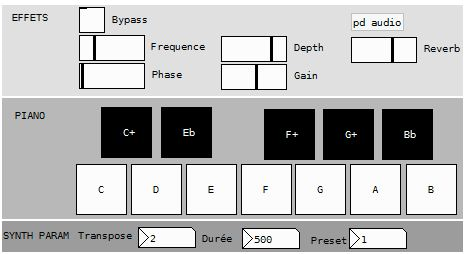
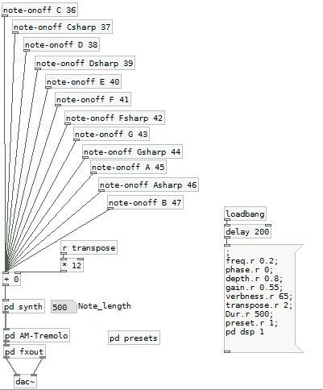
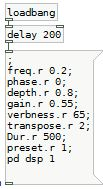

# SYNTHESIZERS
This time we will create a kind of mini Piano.

## HOW DOES IT WORK ?
Our patch is a small piano with a GUI, some effects are incorporated to the controls, you can also choose the transposition factor, the note duration, and you can test out the nine sound presets that are available. This synthesizer is adapted from a patch by Tom Erbe.

## MAIN CONCEPTS 
Appart from sound synthesis several important points will be explained there (as a synthetizer needs to reveive informations to play). Please refere to comments inside the patches.

At the top we have a custom made abstraction to receive data from our interface, it will listen to a specific gui object (one of the piano "keys"), and will toggle messages to play notes with our synth.
Then we have a tremolo effect, a reverb and then our audio output.

It takes a midi pitch for inlet and it needs to have a 'notelength', an 'index', and a 'ratio' parameters set beforehand.

### INITIALIZING PARAMETERS

[loadbang] will send a bang on the startup of the patch, it’s usefull to initiate a lot of parameter such as synth parameters, or effects values etc.

You can use a big message object to bundle all those initialization parameters, you just need to put ';' at the begining and one after each message.

Notice that we wait 200 ms before sending everything, it's just to be sure that every object is loaded first.

### POLYPHONY

Polyphony can be achieved by various ways, it’s much more elegant with dynamic patching, but we will use a simple way of doing it with the [poly] object. This is the way to do it manually in a context where you don't need a lot of voices. (To achieve polyphony with style you can always look up the [u_makepoly] object from the Rj library.)

![The [poly] object](../assets/tuto3-5.png)

[poly] uses two arguments, the first one will indicate the number of voices you want the second one is the voice-stealing argument (that is to say, if all your voices are busy, it will “steal”one to output the new incoming value). [poly] receives a couple of value (note,velocity) respectively left and right inlet (beware, if velocity is 0 it will not output anything, and also the order of argument has it’s importance it should receive velocity first), and will return a triplet (voice_id, note, velocity). Then using [pack f f f] and [route 1 2 3 4] (because we 4 for voices : [poly 4 1]) we will be able to send (note,velocity) couples to voices abstractions or subpatches. In this example we leave the velocity values aside, as the touchscreen has no pressure informations. Furthermore our synth are initialized with a default velocity. An important point is that [route] will get rid of the first number of the list to pass it on : if it receives a message [1 60 127( the ouput of the first outlet will be [60 127(.

### ABSTRACTIONS ET SUBPATCHES

As we already discussed it a litle an abstraction is a Pure Data patch, saved in the same folder as the main patch it can be created by just creating an object with the very same name. It’s the case of the [note-onff] patch (shown in the first snapshot of those explanations). This is useful when we use the same bit of code several times in one patch, if you modify save an abstraction changes will apply to all the places it is used. We can also use arguments when developing abstractions, see the next paragraph for that.
A subpatch is useful to make the code more readable and compact. You just need to create called « pd my_subpatch », a new blank page will popup, you just need to write your code in it, creating inlets and outlets or send and receive will help you to communicate with the rest of your code. You can also just copy/paste a bit of code in it.

### USE OF ARGUMENTS IN ABSTRACTIONS ($0, $1, $2, …)

![Use of arguments in the [note-onoff] abstraction](../assets/tuto3-6.png)

The $0 argument is a bit of a special one. It is used INSIDE abstractions to help us deal with messages inside the abstraction, so that a message sent inside one abstraction stays in it, we will then use $0- as a prefix to those messages. When loading the abstraction $0 will be replaced by a random number (not-redundant), that is to say that one abstraction will then use a “1088-bang” whether the next one will use a “1158-bang”. In the first episode we use this in the [mon_sampleur] abstraction, in the example above we receive [r Dur] it will the same value (coming from the Gui) for all copies of this abstraction.
Using $1, $2, $3 etc is different. It enables you to specify creation arguments. Above in the [note-onoff] abstraction we use $1 and $2. If you create un object called [note-onff C 60], $1 will be replaced by “C” and $2 by “60”. In this case $1 will be used to specify messages names to communicate with the GUI : a 1 will be received when you’ll toggle the toggle labeled “C”, after a delay specified by “Dur”a 0 will be sent back to it to reinitiate it using “C.r”. The same goes for $2 which will be replaced by “60”.

## Ressources

Rjdj library synths start with "s_" and try to make [u_makepoly] work with a few synths it's really powerfull/
https://github.com/rjdj/rjlib

Great examples of sound design with Pd (a truly amazing and interesting ressource) : http://obiwannabe.co.uk/tutorials/html/tutorials_main.html
There’s a full book associated with those, it’s worth the price  : http://aspress.co.uk/ds/about_book.php

Some educational patches made by Tom Erbe : http://musicweb.ucsd.edu/~tre/wordpress/
The soundhack page (externals developed by Tom Erbe as DAW plugins at first the ported to Pure Data (at the bottom of the page on the right are the Pure Data externals) : http://soundhack.henfast.com/freeware/

