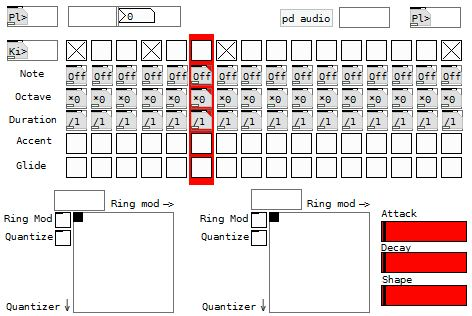
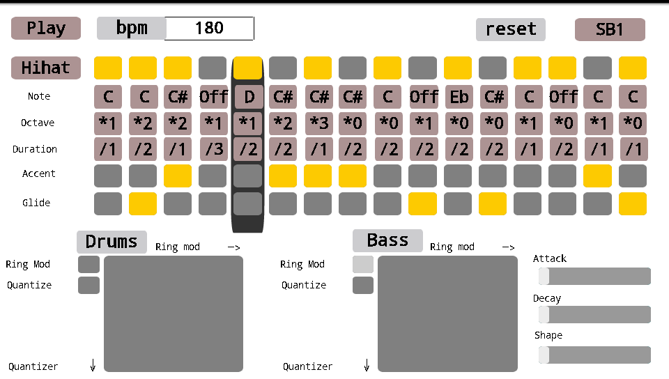
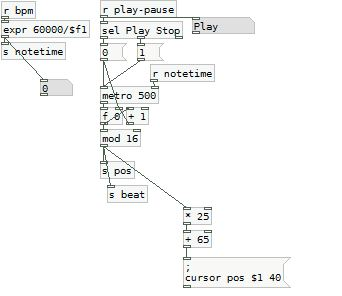
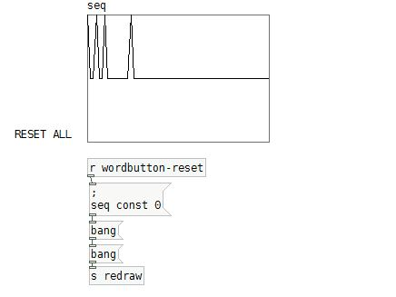
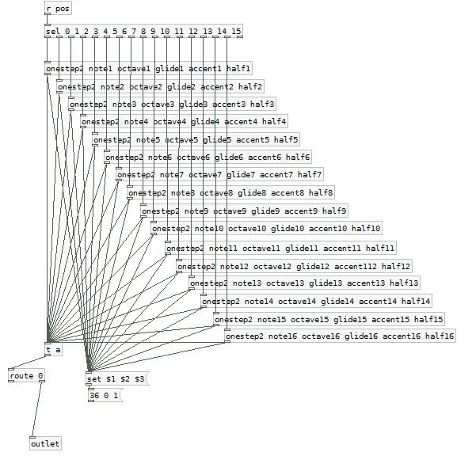

# SEQUENCERS

In this episode we will start building more evolved programs, using graphical interfaces, and those applications will be able to create real musical content. The sequencing concept is very important to electronic music as it will help you to create instruments that will share the same time line.

## HOW DOES IT WORK ?
So what is a sequencer ? A sequencer is a tool to help you synch events between one or more instruments. Simply put a sequencer will cycle through a certain number of steps (ie count from 0 to 15 for a 16-step sequencer), each step you will be able to send one or several values to other parts of your program. If several sequencer are used they can count in synch if they are linked to a common metronome ([metro] object in pd).

The application proposed here, will synthesize what we’ve been discovering in the first three episodes: we will play audio files, use synthesizers, and effects, all together to have a glimpse of what an autonomous application on a smartphone can do.

Our groove box is a drum sequencer with an acid bass instrument. This tool will enable you to build a real rhythmic base for an electro track. After the recent updates on the DroidParty project, we can now use svg templates to improve the visual aspects of our programs. 

## MAIN CONCEPTS 

The button of the upper left corner is used to start a metronome at a chosen speed (through the number box next to it). On the upper right corner the button will enable you to cycle through the soundbankx available for drum sounds.

The line below is our first sequencer that will be used to trigger drums. The button on the left will help you to choose which voice you want to edit between the four available (kick, hihat, snare, cymbal), if you hit the button the voice displayed will change so that you can now edit it. Each toggle represent a step, and there are 16 of them so it is a 16-step sequencer.

The group of five lines controls a bass synthesizer. The first one will control the note that is played (C, Csharp, D …), the second one will adjust the octave of this note (0 bass, 4 high), the third line will let you choose the duration of the note for instance “/2” will play a half note (the length is computed from the tempo you set earlier), the fourth line will enable you to accentuate a note, and the fifth will create a glissando between the previous note and this one.

Right below there is to ‘touch’ surfaces to apply effects on both the drums and the bass synth. On the right there are three sliders to help you change the sound of the synth.

### A DRUM SEQUENCER ?
A sequencer is in most case a series of instructions that will be played in synch with a metronome. A sequencer has a number of step a 16 step sequencer will count from 0 to 15, so you will have sixteen steps to edit synthesis parameters for a given sound.

In pd terms we will be have to build a line of sixteen controllers (ie toggles, sliders or whatever…) to input values, we will then need an object to store each step’s value (usually the right inlet of a [f]object), this value will then be output only when requested by a the combination of a counter (group of object counting from 0 to 15 at a specified tempo) and the object [select 0 1 2 … 15]. So we only have to link each output of the [sel] object to the left inlet of the [f] corresponding to its step and the bang output by [sel] will pass on the value to the output of [f].

In the drum sequencer example we will complicate things a little. As we will store values into an indexed table. This will help us to use less space on our display to control the drumming part. We will only have one line of toggles and a button will enable us to cycle between four voices (potentially a lot more). So every time we press the button we will be able to edit another voice.

To read the table we will have to use several objects, to read from the different indexes. If the retrieved value is zero we will not read the sample if it’s one we will. This method is a little too advanced for this introduction but it was worth mentioning considering the size of the screens we work on. I will not extend on the subject but check out the code to know more. You will learn more about ‘classic-sequencer’ in the next paragraph.

### I WANT TO CONTROL A SYNTH TOO

For this example will use the same counter but we will collect a lot more parameters than just an order to play or stay quiet : a full note will be composed of a pitch, a velocity, and duration (those are three values used in the MIDI protocol) but we will add an accent value (0 or 1 wether the not will be louder or not) and a glissando value (0 no glissando or 1 glissando over the specified duration).

We will receive the ‘pos’ value sent by the counter, and we will “bang” an abstraction which will conform every message coming from the interface to build a new one that our synth will be able to understand.

So the principle is classic, as explained, an abstraction will catch all messages from the interface using floats (=[f]) for a given step. When it’s “banged” it will output all those values in message.

This abstraction will also force the right order of operation using [trigger] or [t]. For instance when using [makenote] we have to give the value in order from right to left. It’s imperative to finish by giving the note argument in last for the object to work properly. But we will learn more about that in the next episode.

![This is the abstraction [onestep] it stores every value from the interface to conform them to standard being able to control the synth.](../assets/tuto4-6.png)

It’s important to notice how the data coming from the [taplist] abstractions is retrieved using the [symbol] object to convert the type of data we are receiving. Beware not to use ‘-‘ and ‘+’ symbols as those will be recognized as indicators to truncate the message.

### SVG theming
Chris is explaining everything very well in the page dedicated to DroidParty. So in short, the simplest solution would be to use the .svg files packed with the program and edit them with any software you want (Inkscape did the trick for me, free and open source). The link between the object and the svg file is made through the ‘send-name’ attributed to this object in pd (right-click -> properties). 

For instance if you create a vertical slider, you specify its send-name to “sliderX”, the corresponding svg file will need to have a name like “Slider-vertical-sliderX.svg”. This is also right for [taplist], [wordbutton], [touch] as well as for toggles, sliders. You cans also change the background of your app using background.svg.

## RESSOURCES & ADVERTIZING

Check out CanOfBeats on the android market : https://market.android.com/details?id=cx.mccormick.canofbeats
and buy it if you want to support droidparty !

A simpler version of the groove box is also available, the main difference is the interface of the drum sequence. Groove box uses a trick to display several patterns with one line of toggle enabling you to switch beetween them by touching a taplist object.

The acid bass synth used in this patch comes from this great set of pd abstractions : http://www.lesobjetsvolants.com/music/index.php

 

