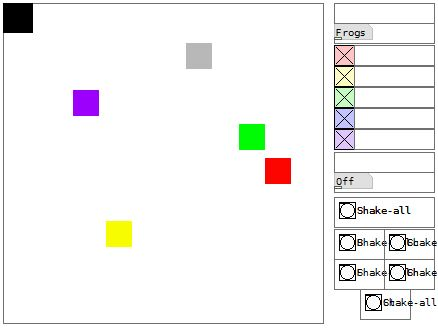
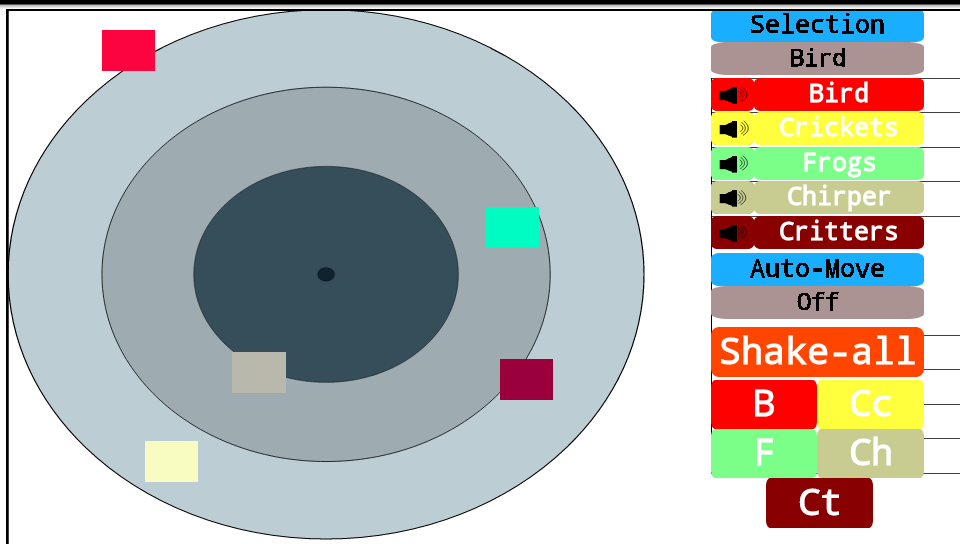
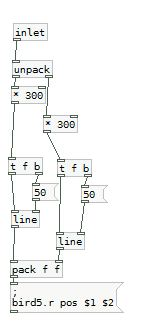
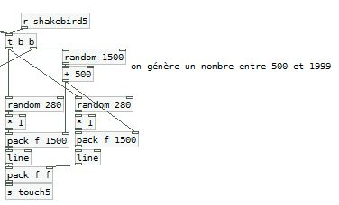
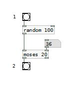
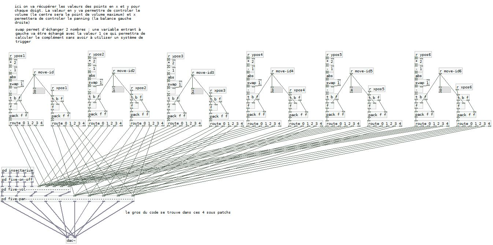
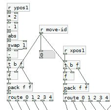

# SPATIALISATION, AND AUTO-GÉNÉRATION

In this episode we will build an audio interactive application using auto generation and spatialization methods.

## HOW DOES IT WORK ?
We want to place a few sounds on 2D plane, and be able to move them around, or make them move on their own
We will control one bird (with several voices), crickets, frogs, critters and circadas. Under the selection button there is a [taplist] abstraction, you can hit it to change which element you can move on the 2D plance, below you can mute or unmute each sound.

Under the 'auto-move' button you can choose to move all of them randomly in one click, or move one according to the buttonyou hit.

## MAIN CONCEPTS

Once again please refer to the comment in the code to have further information . In this section we will focus on how to use images and how to move them across the screen aswell as randomizing some parameters of our program.

Firstofall it’s important to understand that we will not work with something like an image. At the time I'm writing this I can safely state that most of the object cannot be moved under android (this function of pd hasn’t been ported for droidparty yet). We will only depend on the [canvas] object for this kind of interaction (as we have successfully moved one in the 4th episode). We will use the same code : we use a [*300] object to adjust the output of a [touch] abstraction to the size of our surface.

The canvas doesn’t support yet the customization of several objects with several svg files. We will have to keep them as rendered by PdDroidParty.

### USING [RANDOM]: TOWARDS PROBABILITIES

[random] is an object that will allow us to generate pseudo-random numbers. If you create a [random N] object, it will generate a number between 0 and N-1. You can then use several mathematical operations afterwards to force the output to be mapped to a specific interval. In the example below we will generate a time value between 0 and 1999ms and to position values between 0 and 279 with the help of a [line] we will then be able to create a movement from the previous position to a new one over a specified time

It is now easy to build a group of object that will be able to output a bang according to a probability set by the user. You just need to link a [random 100] to a [moses my_probability]. The example below illustrates this principle if you click on the bang on top you’ll have a 20% chance that the second bang will light up, unless you have changed the number inside the numberbox (which I did) so now it’s a 36% chance.

### PANING

The [e_pan] object comes once again from the RJLib. It’s a classic stereo panoramic effect : in the left inlet you can enter a monophonic signal that will be panned to a stereophonic signal using a variable in the right inlet 0 is for left and 1 is for right.

![use of [e_pan]](../assets/tuto5-6.png)

We use one abstraction for each object, it will receive values from the movements of the interface through the routing system illustrated right below.

Each movement parameter xpos1 and ypos1 (for instances) are routed to the right inlets using the move_id parameters. The movement on the x-axis will control stereo placement, and the y-axis will control the volume.

### USING [SWAP] : COLD AND HOT INLETS

For the volume we already get a value from 0 to 1 from the [touch] abstraction, but it outputs a 0 when we are on top of the screen and a 1 at the bottom. What we want is to have the maximum volume (ie 1) in the middle of the screen and 0 on top and at the bottom. We will need to write some code to achieve this :

From (0,1) we multiply by 2 to get to (0,2) then we substract 1 to have a range of (-1,1). So after two objects we now have -1 on top and at the bottom, and 0 when we are in the middle of the screen. We can use [abs] to get the absolute value so now we have 1 on top and at the bottom , and still 0 in the middle. We are almost there… since we just have to calculate ones’ complement of this value. We can use [swap 1] to achieve this. [swap] will exchange inputs and outputs the number in the left inlet will be output to second outlet and vice versa. 

For instance if we receive 0.4 at the left inlet and the argument is 1 we will have the number 1 output at the left outlet and 0.4 at the right outlet. We just have to  to link those two outlet to both inlet of a [- ] object to get the complement.

We need to use [swap] to do this. This is because of what we call hot inlets and cold inlets. A hot inlet will re-evaluate the output each time a variable is throw at it (it’s generally the first inlet on the left), a cold inlet will just store the value waiting for the output to be evaluated. We already use this with [f ] : for instance we store a number using the right inlet but it’s not passed to the output right away, it will ba only when a bang is received on the left inlet.

### USING [SWITCH~]

[switch~] is used to stop DSP (Digital Signal Processing) calculations within a subpatch or an abstraction. It’s usefull to save some CPU cycles when a subpatch is idle. For instance if we have a [noise~] object it will keep on calculating until we use [switch~] to stop it. You can use a basic audio gate to prevent sound from passing, but this will not stop calculations within [noise~] or others objects.

You only have to create the object in a subpatch and send it a 0 or a 1. Zero will stop calculations, one will enable them.

![using [switch~]](../assets/tuto5-9.png)

So we have discovered a few new concepts that will enable us to build more complex interfaces, creating movement, with several levers for interactivity. The use of [random] will be precious in the creation of generative systems.

## RESSOURCES

For more information about spatialisation in Pure Data you can check this link. It’s the files from a workshop taught by Georg Holzman (you’ll need pd-extended though).
http://grh.mur.at/misc/PdSpatialization.tar.gz

Check out Andy's amazing tutorials : http://obiwannabe.co.uk/tutorials/html/tutorials_main.html

