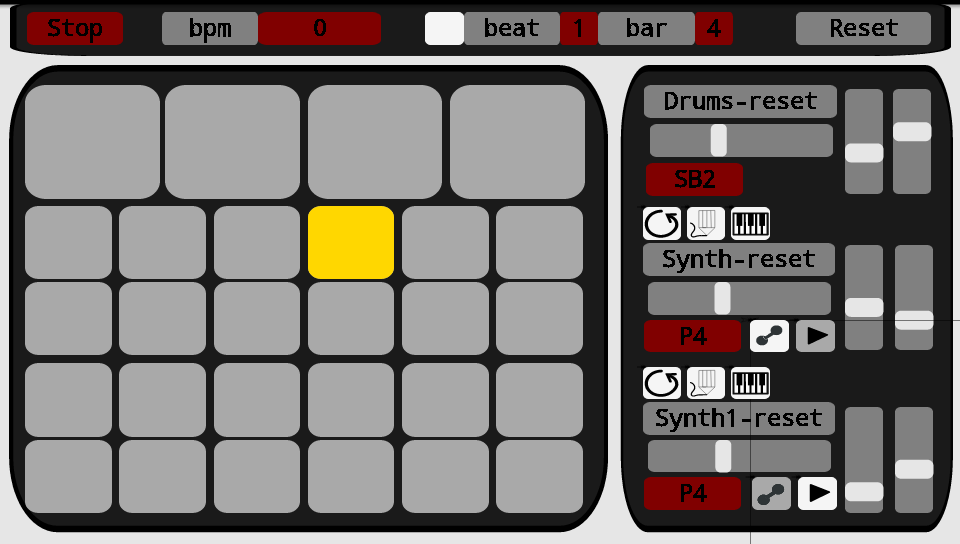
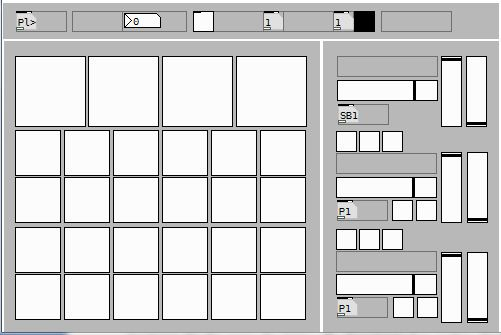
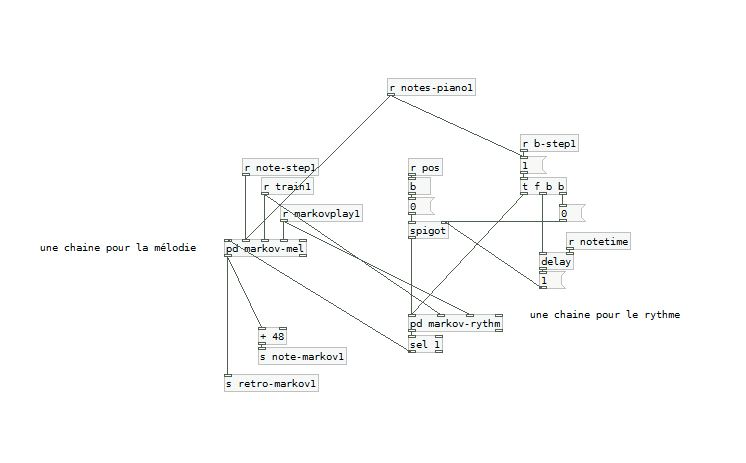

# A FULL FEATURED APPLICATION

This time we will create a much more complex application : a musical app that will be able to generate rhythm and melodies in a ‘smart’ way using markov-chains.

## HOW DOES IT WORK ?

We have the possibility to change the tempo (at very high speed it can create nice textures). The screen can be split in three areas : the bar on top of the screen (switch the sequencer on/off, enter the speed, a audio/visual feedback of the metronome, and a button to reset everything, the left hand side of the screen (grey squares a line of four for 4 drum sounds, and 2*2 lines of six covering each a full octave for a both synths available) which is the playing area, and the right side of the screen which will enable us to control volumes/choose sounds/ choose the play mode and control effects.

The first thing is to choose a tempo, then start the sequencer. Once it’s a done a sequencer will start running, you can then play by hitting the grey square in the left area. According the play modes selected this will produces different behaviours.

The piano mode will let you play as the programm was a piano, the pencil mode   will write the patterns you tap into a table, and the loop mode will play those notes as a loop. Combining those modes will help you to build a melody loop it and improvise on it without modifying its content. (above the synth-reset button, we have in order the piano, the pencil and the loop icons).

Two other modes are available : the training mode   and the improvisation mode  . This will control the markov chain stuff. What it means is that we can generate new melodies based on probability tables created by the analysis of the user input. (below the volume slide we have the training, and the improvise icons)

The vertical sliders are for the effects,  the right ones are reverbs, the left one is a bitcrusher for the drum section, for both other instruments it’s a delay. Horizontal sliders control the volume of each instrument.

## MARKOV CHAINS

The training mode will record all the notes played by the synthesizer once the button is pressed, when released the program will perform markov analysis. That is to say that it will organize notes to know the probability that one note will be followed by another note. For instance after analysis if you input a C in a markov chain it will have 30% chance to output a D, 15% chances to output a B and 55% of another C. Analysing a melody with a markov chain will give the probability for each base note to be followed by any other, using this data we will then be able to generate musical variation of those melodies. It becomes really interesting when using a markov chain to analyse harmonicity  and a second one for rhythm.

It can sound a little complicated, but we will use abstractions from the Rjlib [c_markov] et [m_markovanal]. The help patches are available so check it out for more information.

So we will need two implementations one for the rhythm and one for the melody. For the melody we will receive through the left inlet synchronization data (rythmics bangs to play a melody), then the second inlet will receive the notes played, the third and fourth inlets will turn on or off the “training” and “play” modes (0 or 1). Concerning the rhythm we will receive through the left inlet a 1 if a note is played a 0 if no note is played.

[m_markovanal] will analyze a list of values and give us a histogram of the probabilities for each note in the list. In the training mode we will append all thoses notes in a message, once the training mode is off this list is dumped to [m_markovanal] that will output  all the histograms ready to be used in the right inlet of [c_markov]. A [reset( message can be used to clear everything.

[c_markov] will help us to generate values according to those histogram we calculated. You just have to input a note in the left inlet and it will output  a new note based on the probabilities. We will need to store the last note played to re-inject it at the hot inlet when we will need to calculate the next note.

We will use both objects two time for each synth : once for the rhythm and one for the harmony, that is to say four times in the whole patch.

![The couple [m_markovanal] and [c_markov] together, with the list of notes and the histogram](../assets/tuto6-4.png)

## RESSOURCES

Markov chain on Wikipedia :
http://en.wikipedia.org/wiki/Markov_chain

A full blog on algorithmique using pd :
http://www.algorithmiccomposer.com/search/label/puredata

